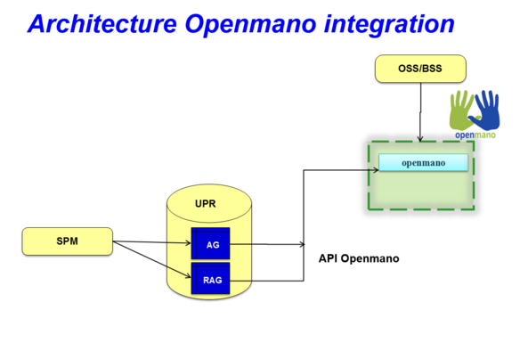

# Preparing Django Server:

Clone the repository into a new directory (i.e. git) and create a django project in another directory (i.e. upr).

Install the dependencies:
```bash
sudo apt-get install mysql-server libmysqlclient-dev python-virtualenv libffi-dev
```

Choose protocol and credentials for clone e.g. git:// or https:// 
```bash
git clone https://github.com/SECURED-FP7/secured-upr.git
virtualenv .env
source .env/bin/activate
pip install django djangorestframework MySQL-python django-rest-swagger wrapt bcrypt python-keystoneclient
cd upr
```


Create the database (choose your own DATABASE_USER and DATABASE_PASS):
	
		mysql -u root -p
			mysql> CREATE DATABASE UPR;
			mysql> GRANT ALL PRIVILEGES ON UPR.* TO 'DATABASE_USER'@'localhost' \
				IDENTIFIED BY 'DATABASE_PASS';
			mysql> GRANT ALL PRIVILEGES ON UPR.* TO 'DATABASE_USER'@'%' \
				IDENTIFIED BY 'DATABASE_PASS';
			mysql> exit

Modify the database information on upr/settings.py:

		DATABASES = {
 		   'default': {

		        'ENGINE': 'django.db.backends.mysql',
       			'NAME':'UPR',
        		'USER': 'DATABASE_USER',
        		'PASSWORD': 'DATABASE_PASS',
        		'HOST': 'localhost',   # Or an IP Address that your DB is hosted on
        		'PORT': '3306',
    			}
		}

	
Synchronize the database

		python manage.py makemigrations
		python manage.py migrate
		

Now you can run the server (make sure you have virtualenv active):
		
		python manage.py runserver YOUR_IP:8081
		
Now you can access the api, according to the documentation. 

You can access to the API reference using the URL http://YOUR_IP:8081/docs/

# Securing the server:
If you want to access the server through https (thus encrypting the petitions and responses), you have to install nginx
	
		sudo apt-get install nginx
		
Now, you have to create a certificate for the server. In this guide we are using a self signed certificate.

First, generate a server key:
		
		openssl genrsa -des3 -out upr.key 2048

You will have to enter a password for the key  
		
Now, generate a Certificate Signing Request:
		
		openssl req -new -key upr.key -out upr.csr
		
You will be asked some infomation (Organization name, country...). It's important that the Common Name is the IP and port in which the server will be running

Now, sign the certificate:

	openssl x509 -req -days 365 -in upr.csr -signkey upr.key -out upr.crt
	
Finally, create a version of the key that doesn't require password:

	openssl rsa -in upr.key -out upr.key.insecure
	mv upr.key upr.key.secure
	mv upr.key.insecure upr.key
	
You will have to pass the certificate (upr.crt) to the clients, and add it to the list of trusted certificates in the clients machine. The exact commands depend on the OS of the machine.

The nginx.conf file contains the configuration needed to run the UPR in https mode, but you will need to modify it to work: Replace YOUR_IP with the IP of the server, and specify the absolute route to the certificate and key

Once the file is ready, copy it to its location:

	sudo cp nginx.conf /etc/nginx/sites-enables/upr

And restart nginx:

	sudo /etc/init.d/nginx restart

Run this command to collect all static files, needed for the documentation:

        python manage.py collectstatic

Now you will have to run an instance of the UPR listening on 127.0.0.1:8887 :

	python manage.py runserver 127.0.0.1:8887 

While this instance is running, you will have access to the API via HTTPS using the IP and port defined in nginx.conf

# Update SECURED-themed documentation page:

To show a SECURED-themed documentation page, copy the files in the directory "change_doc" in the corresponding place:

	base.html -> .env/lib/python2.7/site-packages/rest_framework_swagger/templates/rest_framework_swagger/base.html
	logo_small.png -> .env/lib/python2.7/site-packages/rest_framework_swagger/static/rest_framework_swagger/images/logo_small.png
	screen.css -> .env/lib/python2.7/site-packages/rest_framework_swagger/static/rest_framework_swagger/css/screen.css
	rest_framework_swagger.css -> .env/lib/python2.7/site-packages/rest_framework_swagger/static/rest_framework_swagger/css/rest_framework_swagger.css


# Maintenance: Clear UPR database content

This steps perform a hard reset of the UPR database, removing a existing DB and creating a new empty one 

1.Stop the UPR Server.

    $screen -x upr
    $Ctrl+C
2.Delete and Re-create the database:
First if exist remove "/upr/upr/migrations" directory. 

		mysql -u root -p
		    mysql> DROP DATABASE UPR;
			mysql> CREATE DATABASE UPR;
			mysql> GRANT ALL PRIVILEGES ON UPR.* TO 'DATABASE_USER'@'localhost'IDENTIFIED BY 'DATABASE_PASS';
			mysql> GRANT ALL PRIVILEGES ON UPR.* TO 'DATABASE_USER'@'%' IDENTIFIED BY 'DATABASE_PASS';
			mysql> exit


3.Regenerate empty database schema:

        $cd $HOME
        $source psar/.env/bin/activate
        $cd upr
        $python manage.py makemigrations upr
        $python manage.py migrate


4.If OpenMANO integration is installed then clean the information in OpenMANO:

		cd $HOME/upr/openmanoScripts
        python deleteScenario.py


5.Start the UPR

        $cd $HOME
        $screen -S upr
        $source start_upr.sh
        Ctrl+a+d


# OpenMANO integration 

This additional installation steps, are needed only if you are going to use OpenMANO for represent automatically the scenarios corresponding to application graphs and reconciled application graph.



Internal UPR logic, when detect changes in the Service Graph database tables, triggers the interaction with OpenMANO to create and represent the different graphs in openmano-gui

If you have already installed OpenMANO, you must use the same variables as for the previous installation of OpenMano, and go directly to step "in the django server".

### Installing and configuring Openmano:

Use the next guide for do the automatic installation, and  configuration.
 
[OpenMANO Getting Started](https://github.com/nfvlabs/openmano/wiki/Getting-started)

#### Openvim

Actions related to the infrastructure must be conveyed through the openvim client.

Let's configure the openvim CLI client. Needed if you have changed the openvimd.cfg file

	./openvim config                           # show openvim related variables

	#To change variables run
	export OPENVIM_HOST=<http_host of openvimd.cfg>
	export OPENVIM_PORT=<http_port of openvimd.cfg>
	export OPENVIM_ADMIN_PORT=<http_admin_port of openvimd.cfg>

	#You can insert at .bashrc for authomatic loading at login:
	echo "export OPENVIM_HOST=<...>" >> /home/${USER}/.bashrc
	...
Let's attach compute nodes. For choose the mode, you need change the file **$HOME_OPENMANO/openmano/openvim/openvimd.cfg**. We use 'test' mode.

In 'test' mode we need to provide fake compute nodes with all the necessary information:

  	./openvim host-add test/hosts/host-example0.json 
  	./openvim host-add test/hosts/host-example1.json 
  	./openvim host-add test/hosts/host-example2.json 
  	./openvim host-add test/hosts/host-example3.json 
  	./openvim host-list                        #-v,-vv,-vvv for verbosity levels


Let's list the external networks:

 	./openvim net-list

Let's create some external networks in openvim. These networks are public and can be used by any VNF. It must be noticed that these networks must be pre-provisioned in the compute nodes in order to be effectively used by the VNFs. The pre-provision will be skipped since we are in test mode. Four networks will be created:

* default -> default NAT network provided by libvirt. By creating this network, VMs will be able to connect to default network in the same host where they are deployed.

#
 	./openvim net-create test/networks/net-example0.yaml

Let's list the external networks:

 	./openvim net-list
 	35671f9e-e2b4-11e4-a3c9-52540032c4fa   default
 
	

Now let's create a new tenant "admin":

	$ openvim tenant-create
	tenant name? admin
	tenant description (admin)?
	<uuid>   admin   Created
Take the uuid of the tenant and update the environment variables associated to the openvim tenant:

	export OPENVIM_TENANT=<obtained uuid>
	#echo "export OPENVIM_TENANT=<obtained uuid>" >> /home/${USER}/.bashrc
	openvim config                             #show openvim env variables


#### Openmano
Let's configure the openmano CLI client. This is only necessary if you have changed the file 'openmanod.cfg'


* List the environment variables

        ./openmano config                      #show openmano env variables

* Update the environment variables accordingly:

        export OPENMANO_HOST=<http_host of openmanod.cfg>
        export OPENMANO_PORT=<http_port of openmanod.cfg>
        ./openmano config                      #show openmano env variables

* Let's create a new tenant:

        ./openmano tenant-create mytenant --description=tenant-description
        ./openmano tenant-list                           #show list of tenants uuid and name

* Take the uuid and update the environment variable associated to the openmano tenant:

        export OPENMANO_TENANT=<obtained uuid> 
        ./openmano config                                #show openmano env variables

* Let's create a new datacenter 'mydc' in openmano, attach the datacenter 'mydc' and VIM tenant "admin" (identified by its uuid provided by openvim), and update the external nets automatically from the ones in openvim.

		./openmano datacenter-create mydc http://localhost:9080/openvim
		./openmano datacenter-list --all                           #show all datacenters
		./openmano datacenter-attach mydc --vim-tenant-id <uuid>   #attach the datacenter mydc and openvim tenant id to the openmano tenant 'mytenant'
		./openmano datacenter-list                                 #show datacenters associated to our tenant
		./openmano datacenter-net-update mydc
 		Edit datacenter mydc (y/N)? y
		35671f9e-e2b4-11e4-a3c9-52540032c4fa   default
		./openmano datacenter-net-list mydc
		35671f9e-e2b4-11e4-a3c9-52540032c4fa   default              2015-04-14T17:36:32

#### Openmano-gui

First, edit and configure the ./openmano-gui/config.php file. It is needed to get the tenant added at openmano in the previous step and set the $mano_tenant variable properly. In case of using a different configuration than the explained above, it is needed to modify other variables.

openmano-gui is accesible with url http://server/openmano. It contain three main modules:

* Scenarios. Left side: scenario and instance scenario list. Right side: scenario/instance details of the left side selected element. The upper button allows:
    * New: To create a new scenario dragging and drop the left VNF/nets catalogue. You can connect the VNF interfaces among them with the mouse. Do not forget to save.
    * Action over the left side selected scenario, as Save its topology changes, Deploy it, Clone in order to create a new one using the current scenario as starting point, Delete, ...
    * Action over left side selected instance-scenario, as Update to see the current status of running VNFs, Delete to undeploy the instance, Start, Shutdown, Force off, Reboot, Rebuild over selected VNFs or/and VMs of the instance, ...
* VNFs. Left side: list of VNF and external nets. Right side: under construction
* Physical. Left side: list of openvim compute nodes and deployed virtual machines. Right side: under construction


### In the Django Server:

* Update the server
    * If you are already running a UPR instance, access to the virtual environment where you are running it and stop the service:

    		screen -x UPR
    		Ctrl+c (Kill server)


    * Replace in **/upr/upr.conf** 'obtained uuid', 'Openmano ip' and 'Openmano port'

	    	[mano]
	    	tenant = obtained uuid
    		ipMano = Openmano ip
	    	portMano = Openmano port
            pathScenario= $HOME/upr/scenarioOpenmano

    * Default path for scenarios is 'pathScenario=$HOME/upr/scenarioOpenmano', you need to  create them:

    		mkdir $HOME/upr/scenarioOpenmano
		

* The first time that you use Openmano, you need do the next steps. 
    * Create VNF named linux, TVD and PSA. 

            cd $HOME/upr/openmanoScripts
            python createVNF.py
    * Represent the application graphs and reconciled application graphs that you have on your DDBB.
    
            cd $HOME
            source .env/bin/activate
            cd $HOME/upr
            python manage.py shell < initOpenmano.py

* Restart the instance of UPR
    
		screen -x UPR
		cd $HOME/upr
		python manage.py runserver 127.0.0.1:8887 

Leave running the session with Ctrl+a+d

If you have integrated the UPR and PSAR with Openmano, to represent scenarios with the PSAS, you have defined in the PSAR, it is necessary that these PSAS have been created in openmano before represent the scenario.


# References:

*	<https://github.com/nfvlabs/openmano/>

